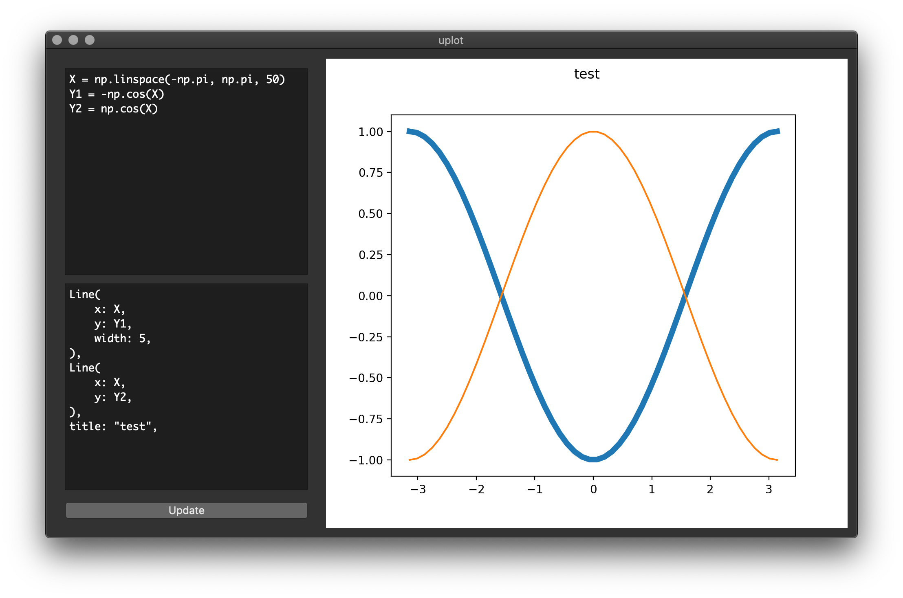

# uplot

Experiments with a declarative plotting & visualisation tool.

End goal is for a live two-way interactive user interface between code and traditional UI controls (inspired by Swift UI).

Currently uses matplotlib as a backend with a very basic Qt GUI.

## Screenshot

